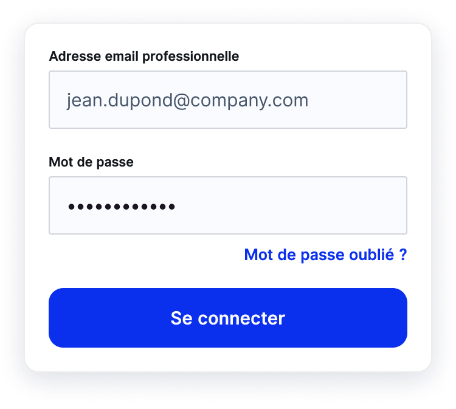

If you've forgotten your password or are having trouble logging in, you can reset your password:

1. Click on **Forgot Password?** on the login page.
2. Enter your email address and click **Send**
3. You'll instantly receive an email containing a link to reset your password. The procedure to follow is detailed in the email.
4. Click on this link and then follow the instructions to create a new password.
5. At the end of the process, once your new password is saved, enter it along with your email address and click **Log In**

You are now connected again to your travel companion, travel with peace of mind 🙂