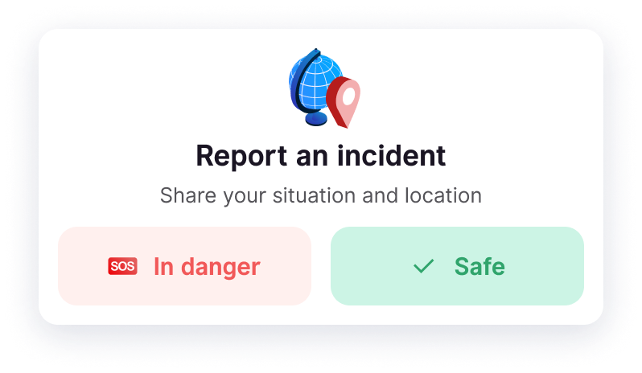

**Safety Check** feature is available to ensure your safety and well-being during your travels.

These buttons are used **to instantly send your location** and the emergency status of your situation to your employer with just one click in case of imminent danger near you:

1. Go to the **Assistance** tab.
2. Click on **In danger** or **Safe** at the top of the page
3. An email informing your status along with your geolocation is sent to your employer instantly.

In addition to reporting imminent danger, these buttons also allow you **to alert and trigger health and emergency assistance** provided by your company (option set during the implementation of HtoH).

You can also request support from the providers recognized by your company to receive appropriate assistance for any unforeseen events occurring during your trip.