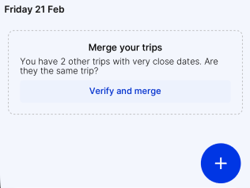

When your original trip has been split into multiple smaller trips, you can always merge them to simplify your trip organization.

The HtoH app automatically detects if you have trips with overlapping dates. If this happens, at the bottom of your Timeline screen, a message will appear like this:

1. Click on "Verify and merge"
2. On the "Merge trips" screen, select the correct trips to merge
3. Confirm by clicking "Merge".