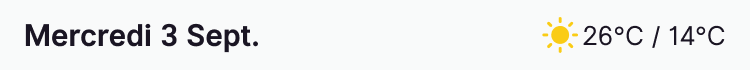

📌 The weather forecasts provided by our application are estimates, and our team cannot be held responsible for any discrepancies between the forecasts and the actual conditions

In each trip agenda, you can see the weather forecast for each day:

1. Go to a trip.
2. At the beginning of each new day, the weather is indicated by an icon along with the estimated maximum and minimum temperatures for the entire day.

Rest assured, these weather forecasts are for the dates scheduled for your trips.