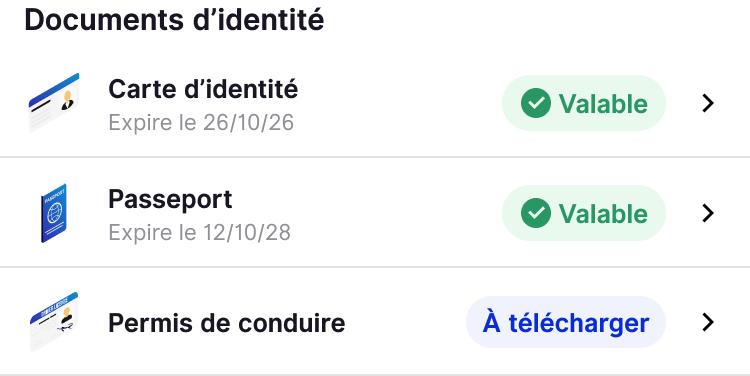

Dans l’application, téléchargez 4 types de documents essentiels pour voyager : Carte d'identité, Passeport, Permis de conduire et Visa

1. Allez dans l'onglet Wallet
2. Dans la section Documents d'identité, cliquez sur le document de votre choix
3. Prenez en photo le recto du document. *Optionnel : Prenez ensuite le verso.*
4. Sélectionnez le type de document. Le N° de la carte et la date d'expiration sont facultatifs.
5. Enregistrez

Dans le cadre de la conformité RGPD sur la sécurité des données privées, nous assurons une confidentialité stricte, vos documents ne sont accessibles nulle part ailleurs que sur votre appareil.

A noter cependant que les copies des documents conservées dans HtoH ont pour objectif de pallier à un besoin de tranquillité. Les pièces conservées ne sont pas des documents officiels.
