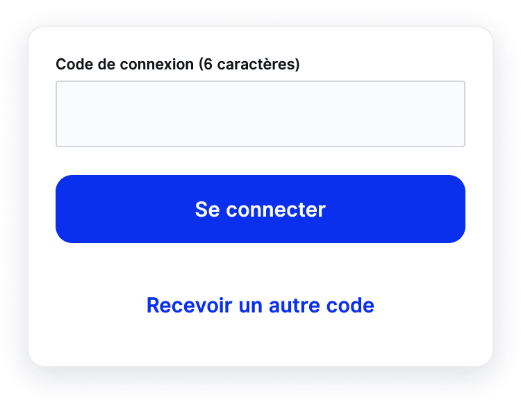

## Télécharger l'application

Allez dans votre store

**[Google Play](https://play.google.com/store/apps/details?id=app.htoh)**

**[App Store](https://apps.apple.com/us/app/htoh/id1584656427)**

## Se connecter à l'application par code temporaire

Si vous préférez la connexion sans mot de passe, connectez vous à l’aide d’un code temporaire. Tout aussi sécurisé, ce système de connexion consiste à recevoir un code envoyé sur votre adresse email, valable 5 minutes et à usage unique :

1. Ouvrez l’application et cliquez sur **Se connecter**
2. Saisissez votre adresse email puis cliquez sur **Se connecter par code temporaire**
3. Confirmez votre adresse email en cliquant une nouvelle fois sur **Recevoir un code temporaire**
4. Vous recevez instantanément un code à 6 chiffres par email dans votre boîte de réception
5. Retournez dans l’application pour saisir ou copier-coller ce code
6. Cliquez sur **Se connecter**, l’aventure peut débuter !

## Se connecter à l'application par mot de passe

Si vous préférez créer un mot de passe, vous en avez également la possibilité et le principe est équivalent :

1. Ouvrez l’application et cliquez sur **Se connecter**
2. Saisissez votre adresse email puis cliquez sur **Se connecter par mot de passe**
3. Suivez ensuite les instructions pour créer votre mot de passe

Si vous avez oublié votre mot de passe ou rencontrez des difficultés à vous connecter, consultez [Comment réinitialiser mon mot de passe ?](/fr/support-and-assistance/reset-password)

## Activez les notifications

A la 1ère connexion, votre téléphone vous demande si vous souhaitez activer les notifications, **nous vous recommandons d’approuver l’activation des notifications** afin d’être alerté en temps réel. Nous vous expliquons ici [Comment activer ou désactiver les notifications système HtoH de mon téléphone ?](/fr/trips-management/system-notifications)