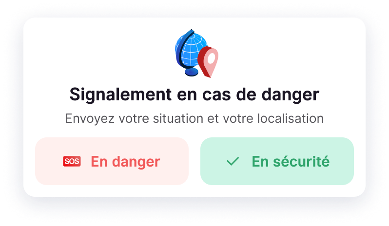

La fonctionnalités “Signalement en cas de danger”, aussi appelée Safety Check, est à votre disposition pour garantir votre sécurité et votre bien-être lors de vos déplacements.

Ces boutons servent à **envoyer votre position** instantanément et en 1 seul clic à votre employeur ainsi que l’état d’urgence de votre situation en cas de danger proche de vous :

1. Allez dans l’onglet **Assistance**
2. Cliquez sur **En danger** ou **En sécurité** en haut de la page
3. Un email informant de votre état ainsi que la géolocalisation de votre position est envoyé à votre employeur instantanément

En plus de signaler un danger imminent, ces boutons vous permettent également de **prévenir et de déclencher des aides sanitaires et d’urgence** prévues par votre entreprise (option paramétrée lors de l’implémentation de HtoH)

Vous pouvez solliciter le support des prestataires reconnus par votre entreprise afin de recevoir une assistance appropriée pour tout aléa survenant pendant votre déplacement.