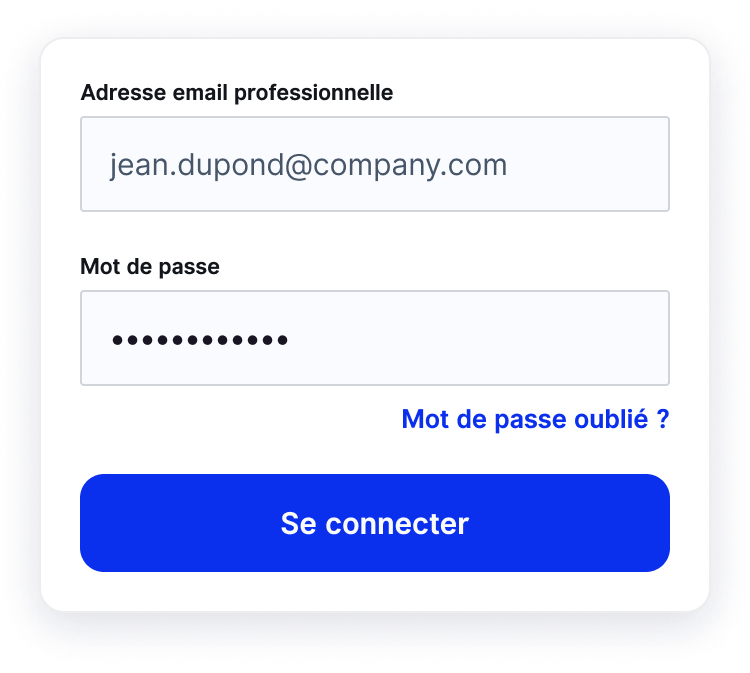

Si vous avez oublié votre mot de passe ou rencontrez des difficultés à vous connecter, vous pouvez réinitialiser votre mot de passe :

1. Cliquez sur **Mot de passe oublié ?** sur la page de connexion
2. Renseignez votre adresse email puis cliquez sur **Envoyer**
3. Vous recevez instantanément un email contenant un lien pour réinitialiser votre mot de passe. La procédure à suivre est détaillée dans l’email.
4. Cliquez sur ce lien puis suivez les instructions afin de créer un nouveau mot de passe
5. A la fin du parcours, une fois que votre nouveau mot de passe est enregistré, saisissez le avec votre adresse email puis cliquez sur **Se connecter**

Vous voici à nouveau connecté à votre compagnon de voyage, voyagez sereinement 🙂